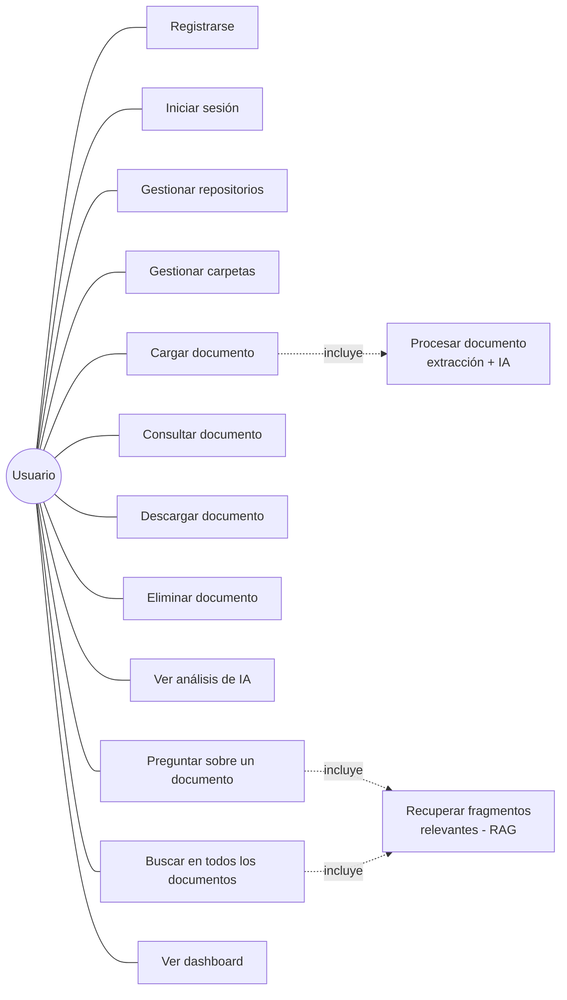

# DOCUMENTO DE CASOS DE USO
## Sistema Inteligente de Gestión y Análisis Documental

---

## 1. Actor

| Actor | Descripción |
|---|---|
| Usuario | Persona registrada que gestiona sus propios repositorios, carpetas y documentos, y consulta el análisis generado por la IA. |

*El sistema no tiene actores administradores diferenciados en la lógica actual — cada usuario opera únicamente sobre sus propios datos.*

## 2. Diagrama de casos de uso

## 3. Descripción detallada de los casos de uso principales

### CU01 — Registrarse
- **Actor:** Usuario
- **Precondición:** el correo no debe estar ya registrado.
- **Flujo principal:**
  1. El usuario ingresa nombre, correo y contraseña.
  2. El sistema valida que el correo sea único.
  3. El sistema almacena la contraseña con hash `bcrypt`.
  4. El sistema confirma el registro.
- **Flujo alterno:** si el correo ya existe, el sistema responde con error `400` sin crear el usuario.
- **Postcondición:** el usuario queda registrado y puede iniciar sesión.

### CU02 — Iniciar sesión
- **Actor:** Usuario
- **Precondición:** tener una cuenta registrada.
- **Flujo principal:**
  1. El usuario ingresa correo y contraseña.
  2. El sistema verifica las credenciales.
  3. El sistema genera y entrega un token JWT.
- **Flujo alterno:** credenciales incorrectas → error `401`, no se entrega token.
- **Postcondición:** el usuario queda autenticado y puede acceder a las rutas protegidas durante 60 minutos.

### CU03 — Gestionar repositorios
- **Actor:** Usuario autenticado
- **Flujo principal:**
  1. El usuario crea un repositorio (nombre, descripción opcional).
  2. El sistema lo asocia al usuario autenticado (`owner_id`).
  3. El usuario puede listar, editar o eliminar únicamente sus propios repositorios.
- **Regla de negocio:** un usuario nunca puede ver ni modificar repositorios de otro usuario.

### CU04 — Gestionar carpetas
- **Actor:** Usuario autenticado
- **Precondición:** debe existir al menos un repositorio propio.
- **Flujo principal:**
  1. El usuario crea una carpeta dentro de un repositorio propio.
  2. El sistema valida que el repositorio le pertenezca.
  3. El usuario puede listar o eliminar carpetas de ese repositorio.

### CU05 — Cargar documento (incluye CU13 — Procesar documento)
- **Actor:** Usuario autenticado
- **Precondición:** debe existir una carpeta propia donde cargarlo.
- **Flujo principal:**
  1. El usuario selecciona un archivo PDF, DOCX o TXT y la carpeta destino.
  2. El sistema valida extensión, tamaño, contenido no vacío y firma real del archivo.
  3. El sistema guarda el archivo físicamente y crea el registro en base de datos con estado `pendiente`.
  4. El sistema ejecuta automáticamente el CU13 (extracción de texto, clasificación, resumen, extracción de información, generación de fragmentos y embeddings).
  5. El documento queda en estado `procesado`.
- **Flujo alterno:** archivo inválido (extensión no permitida, vacío, o contenido que no coincide con la extensión declarada) → error `400`, no se crea el documento.
- **Flujo alterno 2:** falla la extracción de texto → estado `error`, se registra en `processing_logs`.
- **Flujo alterno 3:** el texto se extrae bien pero falla algún paso de IA → el documento queda igualmente en `procesado` (con su texto disponible), y el error de IA se registra por separado — el documento nunca se pierde.

### CU06 — Consultar documento (incluye CU09 — Ver análisis de IA)
- **Actor:** Usuario autenticado
- **Precondición:** el documento debe pertenecer al usuario.
- **Flujo principal:**
  1. El usuario abre el detalle de un documento propio.
  2. El sistema retorna el texto extraído y, si existe, el resultado de IA: categoría, resumen e información estructurada.

### CU07 — Descargar documento
- **Actor:** Usuario autenticado
- **Flujo principal:** el usuario solicita la descarga; el sistema retorna el archivo original tal como fue subido.

### CU08 — Eliminar documento
- **Actor:** Usuario autenticado
- **Flujo principal:** el usuario elimina un documento propio; el sistema borra el registro y sus datos asociados (categorías, resultado de IA, fragmentos).

### CU10 — Preguntar sobre un documento (incluye CU14 — Recuperar fragmentos relevantes)
- **Actor:** Usuario autenticado
- **Precondición:** el documento debe tener fragmentos y embeddings generados.
- **Flujo principal:**
  1. El usuario escribe una pregunta sobre un documento específico.
  2. El sistema calcula el embedding de la pregunta y busca los fragmentos más similares (similitud coseno) dentro de ese documento.
  3. Si hay fragmentos suficientemente relevantes (por encima del umbral), el sistema genera una respuesta basada únicamente en ellos, junto con las fuentes usadas.
  4. Si no hay evidencia suficiente, el sistema responde exactamente: *"No se encontró información suficiente en los documentos disponibles."*
- **Regla de negocio:** el sistema nunca debe responder con información que no esté en el contenido recuperado.

### CU11 — Buscar en todos los documentos
- **Actor:** Usuario autenticado
- **Flujo principal:** igual que CU10, pero la búsqueda de fragmentos relevantes se hace sobre todos los documentos propios del usuario, no solo uno.

### CU12 — Ver dashboard
- **Actor:** Usuario autenticado
- **Flujo principal:** el sistema muestra: total de repositorios, total de documentos, documentos por estado (procesado/pendiente/error), documentos por formato, y los últimos documentos cargados.

## 4. Matriz resumen de reglas de negocio transversales

| Regla | Aplica a |
|---|---|
| Todo dato (repositorio, carpeta, documento) pertenece a un único usuario y solo él puede verlo/modificarlo | CU03, CU04, CU05, CU06, CU07, CU08, CU10, CU11, CU12 |
| Toda ruta excepto registro y login requiere JWT válido | Todos los casos de uso excepto CU01 y CU02 |
| Ningún error de procesamiento hace perder el documento ya guardado | CU05 |
| El sistema nunca inventa información al responder preguntas | CU10, CU11 |
