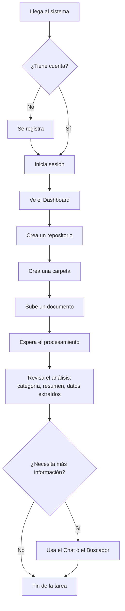

# DOCUMENTO DE EXPERIENCIA DE USUARIO (UX)
## Sistema Inteligente de Gestión y Análisis Documental

---

## 1. Objetivo del documento

Describir cómo interactúa el usuario con el sistema, las decisiones de usabilidad aplicadas en el frontend construido (Fases 7-9), y las oportunidades de mejora identificadas. No se realizó un proceso formal de investigación de usuarios (entrevistas, pruebas de usabilidad con terceros); este documento describe la experiencia tal como quedó implementada y evaluada por el propio desarrollador.

## 2. Perfil de usuario objetivo

| Aspecto | Descripción |
|---|---|
| Quién | Personal administrativo o de gestión documental de una empresa (perfil no técnico) |
| Necesidad principal | Encontrar y entender información dentro de documentos sin leerlos completos |
| Frecuencia de uso | Recurrente — carga de documentos por lotes, consulta ocasional |
| Nivel técnico esperado | Bajo-medio; debe poder usar el sistema sin capacitación técnica previa |

## 3. Flujo de usuario (user journey)



**Punto crítico del flujo:** el paso "Espera el procesamiento" (H→I) es el momento de mayor fricción — puede tardar varios segundos por la llamada a la API de IA, y actualmente el usuario solo ve el estado del documento al recargar/consultar, sin una barra de progreso o notificación en tiempo real.

## 4. Principios de usabilidad aplicados

| Principio | Cómo se aplicó |
|---|---|
| Visibilidad del estado del sistema | Botones muestran "Ingresando...", "Subiendo...", "Cargando..." mientras hay una petición en curso |
| Prevención de errores | El formulario de registro exige contraseña de mínimo 8 caracteres antes de enviarla; los campos de tipo `email` se validan en el navegador |
| Manejo de errores visible | Mensajes de error en rojo (`error-message`) se muestran directamente en el formulario, no como alertas genéricas del navegador (excepto en la subida de documentos, ver sección 6) |
| Navegación consistente | Sidebar fijo con las 5 secciones principales, siempre visible tras iniciar sesión |
| Control del usuario | Confirmación (`confirm()`) antes de eliminar un repositorio o documento, para evitar borrados accidentales |
| Persistencia de sesión | El usuario no debe volver a loguearse al recargar la página, mientras el token siga vigente |
| Feedback de éxito | Mensaje de confirmación tras registrarse, antes de redirigir al login |

## 5. Estructura de pantallas (wireframe textual)

```
┌─────────────────────────────────────────────┐
│ [Sidebar]        │  [Contenido de la página]  │
│ Sistema Documental│                            │
│                   │  Dashboard:                │
│ Dashboard         │  ┌──────┐┌──────┐┌──────┐  │
│ Repositorios      │  │ Repos││ Docs ││ Proc.│  │
│ Documentos        │  └──────┘└──────┘└──────┘  │
│ Buscador          │  Documentos por formato    │
│ Chat IA           │  Últimos documentos        │
│                   │                            │
│ [Nombre usuario]  │                            │
│ [Cerrar sesión]   │                            │
└─────────────────────────────────────────────┘
```

Las pantallas de **Login** y **Registro** son las únicas sin sidebar (pantalla completa centrada), ya que el usuario todavía no tiene contexto de navegación en ese punto.

## 6. Problemas de usabilidad identificados (honestos, no resueltos aún)

| Problema | Impacto | Mejora sugerida |
|---|---|---|
| Los errores al subir un documento se muestran con `alert()` del navegador | Rompe la consistencia visual del resto de la app; se ve "poco profesional" | Reemplazar por el mismo componente de `error-message` usado en login/registro |
| No hay indicador visual de progreso durante el procesamiento IA (solo "Subiendo...") | El usuario no sabe si sigue procesando o ya terminó | Agregar un estado "Procesando con IA..." consultando `GET /documents/{id}` cada pocos segundos hasta que `status` cambie |
| Los diálogos de confirmación (`confirm()`) son del navegador, no del diseño del sistema | Inconsistencia visual | Reemplazar por un modal propio |
| La navegación entre carpetas no muestra "breadcrumbs" (repositorio > carpeta actual) | El usuario puede perder el contexto de dónde está parado | Agregar una ruta de navegación visible en la parte superior de Documentos |
| El chat no distingue visualmente el documento seleccionado de forma prominente | Confusión si el usuario cambia de documento sin darse cuenta | Mostrar el nombre del documento activo en un encabezado fijo dentro del chat |
| No hay estado vacío diseñado (ej. "Aún no tienes repositorios, crea el primero") | Un usuario nuevo ve listas vacías sin guía | Agregar mensajes de estado vacío con una llamada a la acción |

## 7. Accesibilidad — estado actual

- Los formularios usan elementos `<label>` asociados a sus `<input>`, lo cual es una base accesible correcta.
- **No implementado:** atributos `aria-*`, manejo de foco al navegar entre rutas, ni pruebas con lector de pantalla. Queda como mejora futura si el proyecto se lleva a un entorno real de producción.

## 8. Pruebas de usabilidad realizadas

No se realizaron pruebas de usabilidad formales con usuarios externos. La validación de la experiencia se hizo mediante uso directo del propio desarrollador durante las Fases 7 a 9, verificando que cada flujo (login, carga de documento, chat, dashboard) fuera completable sin errores bloqueantes. No se reporta aquí ninguna métrica (tiempo de tarea, tasa de éxito, etc.) que no haya sido efectivamente medida.
