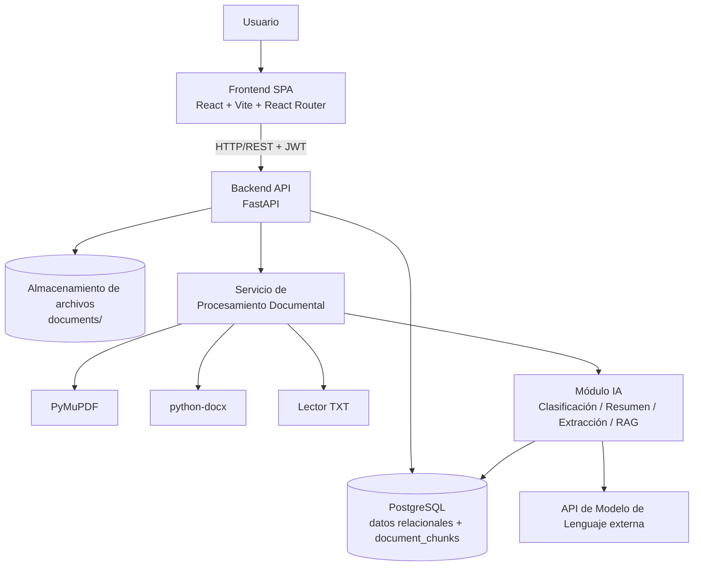
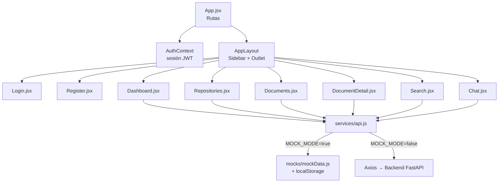
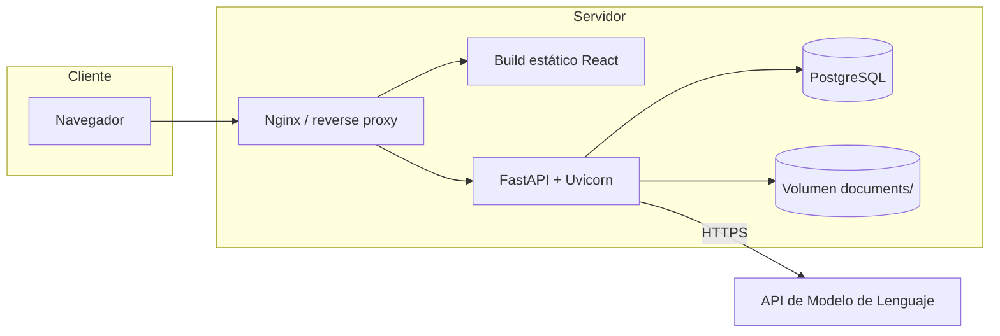

# Diagrama de Arquitectura
## Sistema Inteligente de Gestión y Análisis Documental — "Legajo"
**UTS – Tecnología en Desarrollo de Software – VI semestre**

---

## 1. Visión general

Arquitectura **cliente-servidor de 3 capas + capa de IA**, desacoplada mediante API REST. El frontend (SPA en React) nunca accede directamente a la base de datos ni a la API de IA: todo pasa por el backend FastAPI, que centraliza autenticación, reglas de negocio y orquestación del pipeline documental.

## 2. Componentes por capa

| Capa | Responsabilidad | Tecnología |
|---|---|---|
| Presentación | Renderizado de UI, enrutamiento, manejo de sesión (JWT en memoria/localStorage) | React, Vite, React Router, Axios, Recharts |
| Aplicación / negocio | Validación de entrada, autorización, orquestación de servicios | FastAPI, Pydantic |
| Persistencia | Almacenamiento relacional y de fragmentos vectorizados | PostgreSQL (+ `pgvector` opcional) |
| Procesamiento documental | Extracción y limpieza de texto por tipo de archivo | PyMuPDF, python-docx, lector TXT |
| IA | Clasificación, resumen, extracción estructurada, RAG | Módulo `ai/` + API de modelo de lenguaje vía `.env` |
| Archivos | Almacenamiento binario de los documentos originales | Sistema de archivos `documents/` |

## 3. Componentes internos del Frontend (implementado en Fase 7)

> Nota: el frontend se construyó con una capa `services/api.js` que expone las mismas funciones (`getRepositories`, `uploadDocument`, `askDocument`, etc.) sin importar si se resuelven contra datos simulados o contra el backend real. Cambiar `MOCK_MODE` a `false` conecta el frontend al backend de las Fases 2-6 sin tocar las páginas.

## 4. Vista de despliegue (objetivo, Fase 11)

## 5. Decisiones de límites de responsabilidad

- El frontend **no** contiene lógica de negocio (clasificación, cálculo de confianza, RAG); solo presenta lo que el backend devuelve.
- El frontend **no** guarda la contraseña ni el hash; solo el token JWT y los datos públicos del usuario (`id`, `name`, `email`, `role`).
- La clave de la API de IA vive únicamente en el backend (`.env`), nunca en el bundle del frontend.
