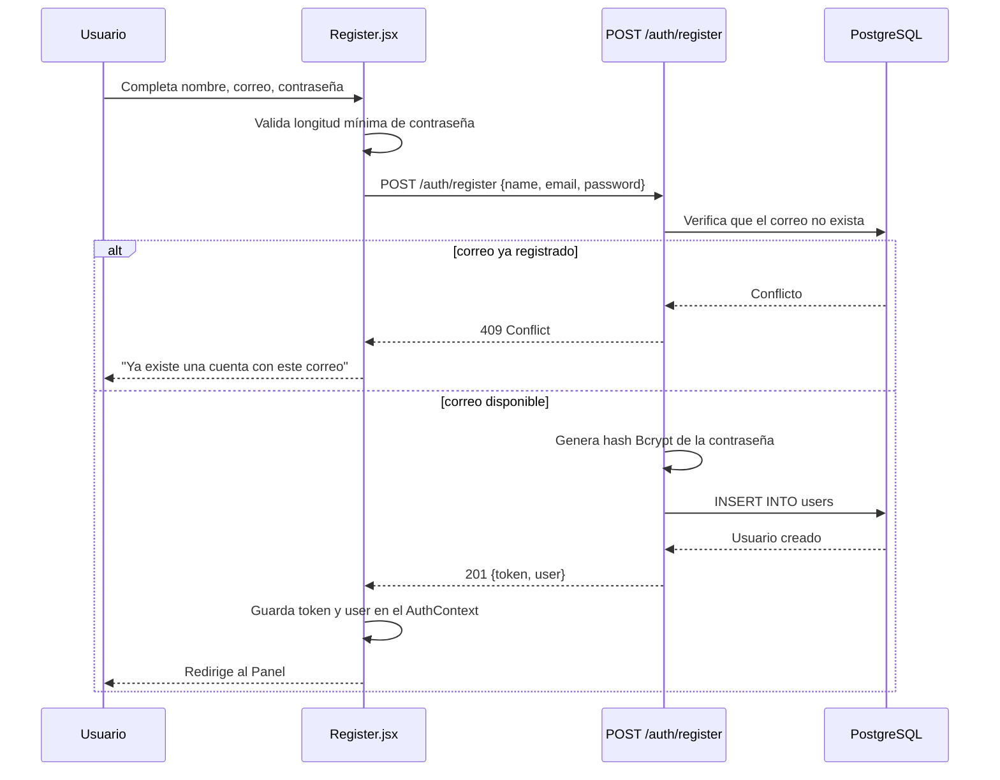
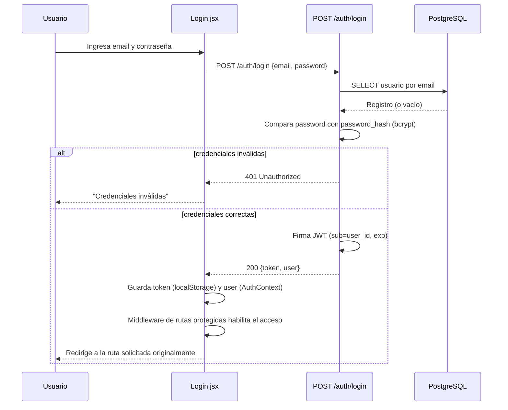
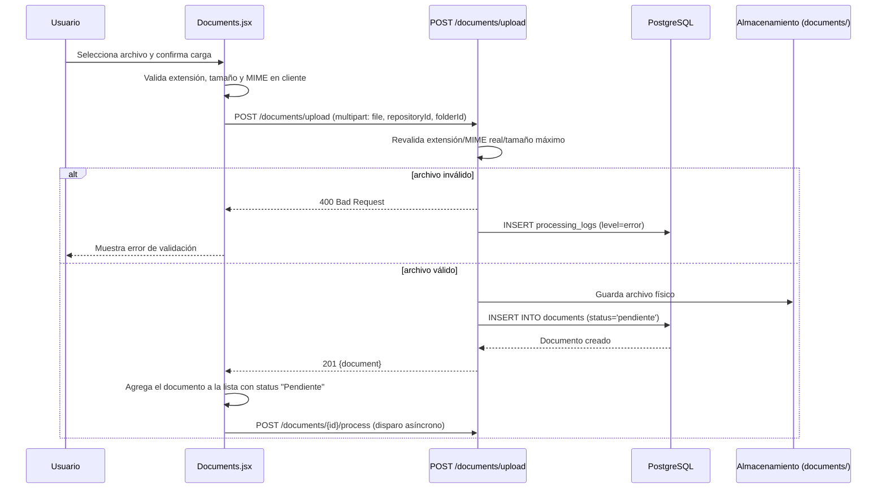
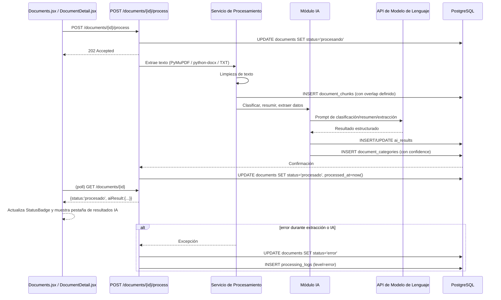
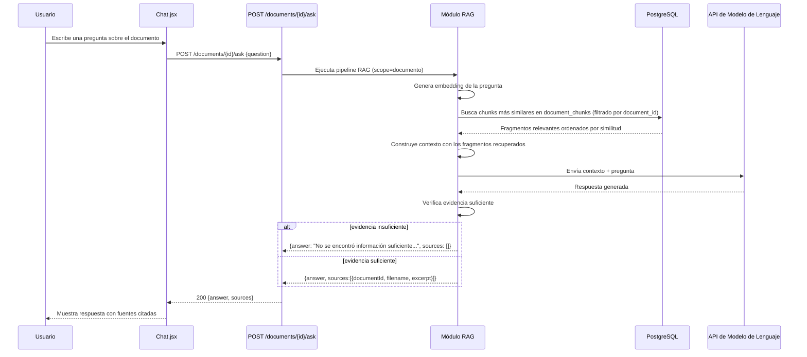
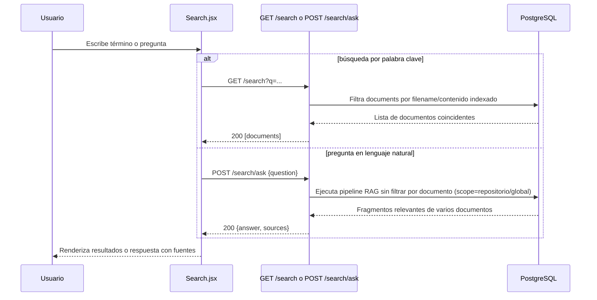
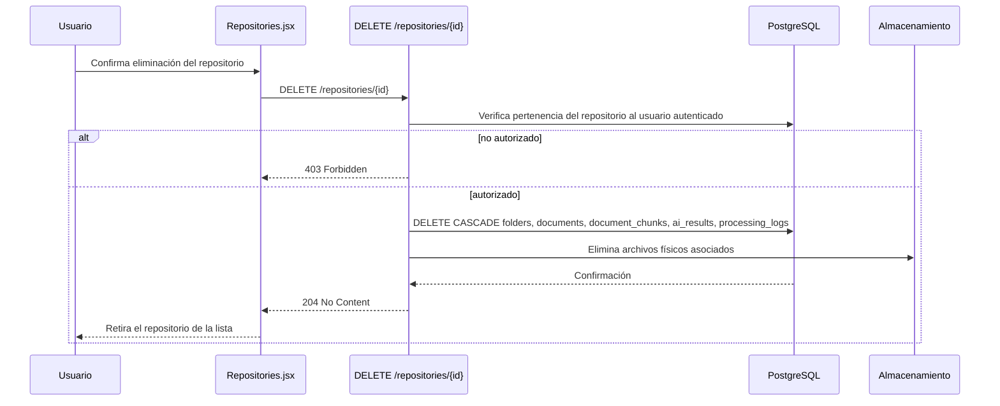

# Diagramas de Secuencia
## Sistema Inteligente de Gestión y Análisis Documental — "Legajo"

---

## 1. Registro de usuario

## 2. Inicio de sesión

## 3. Carga de documento

## 4. Procesamiento con IA

## 5. Pregunta sobre un documento específico (RAG)

## 6. Búsqueda global (semántica + palabra clave)

## 7. Eliminación de repositorio (con documentos asociados)

