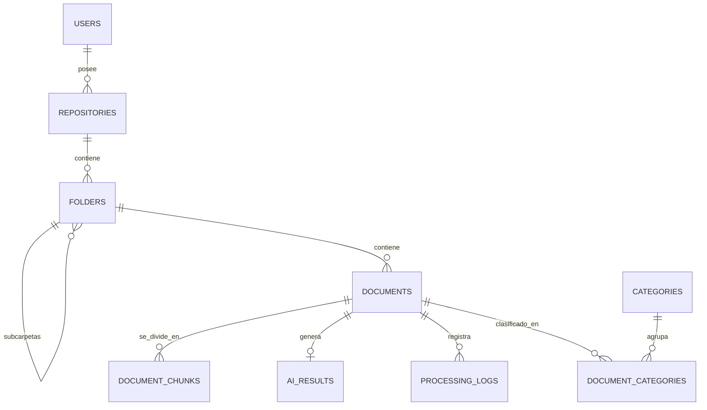

# Diccionario de Datos
## Sistema Inteligente de Gestión y Análisis Documental — "Legajo"

Modelo relacional en PostgreSQL. Tipos expresados en sintaxis estándar SQL; `UUID` se usa como clave primaria en todas las tablas para evitar IDs predecibles.

---

## 1. `users`

| Campo | Tipo | Restricciones | Descripción |
|---|---|---|---|
| id | UUID | PK, default `gen_random_uuid()` | Identificador único del usuario |
| name | VARCHAR(150) | NOT NULL | Nombre completo |
| email | VARCHAR(255) | NOT NULL, UNIQUE | Correo institucional, usado para login |
| password_hash | VARCHAR(255) | NOT NULL | Hash Bcrypt de la contraseña (nunca se expone en las respuestas) |
| role | VARCHAR(30) | NOT NULL, DEFAULT `'docente'` | Rol del usuario (`docente`, `estudiante`, `admin`) |
| created_at | TIMESTAMPTZ | NOT NULL, DEFAULT `now()` | Fecha de creación de la cuenta |
| updated_at | TIMESTAMPTZ | NOT NULL, DEFAULT `now()` | Última actualización del registro |

---

## 2. `repositories`

| Campo | Tipo | Restricciones | Descripción |
|---|---|---|---|
| id | UUID | PK | Identificador del repositorio |
| owner_id | UUID | FK → `users.id`, NOT NULL | Usuario propietario |
| name | VARCHAR(150) | NOT NULL | Nombre del repositorio |
| description | TEXT | NULL | Descripción libre |
| created_at | TIMESTAMPTZ | NOT NULL, DEFAULT `now()` | Fecha de creación |

**Relación:** `users (1) → (N) repositories`

---

## 3. `folders`

| Campo | Tipo | Restricciones | Descripción |
|---|---|---|---|
| id | UUID | PK | Identificador de la carpeta |
| repository_id | UUID | FK → `repositories.id`, NOT NULL | Repositorio al que pertenece |
| parent_id | UUID | FK → `folders.id`, NULL | Carpeta padre (auto-referencia para subcarpetas) |
| name | VARCHAR(150) | NOT NULL | Nombre de la carpeta |
| created_at | TIMESTAMPTZ | NOT NULL, DEFAULT `now()` | Fecha de creación |

**Relación:** `repositories (1) → (N) folders`, `folders (1) → (N) folders` (subcarpetas)

---

## 4. `documents`

| Campo | Tipo | Restricciones | Descripción |
|---|---|---|---|
| id | UUID | PK | Identificador del documento |
| folder_id | UUID | FK → `folders.id`, NULL | Carpeta contenedora (NULL = raíz del repositorio) |
| repository_id | UUID | FK → `repositories.id`, NOT NULL | Repositorio al que pertenece (desnormalizado para consultas rápidas) |
| filename | VARCHAR(255) | NOT NULL | Nombre original del archivo |
| storage_path | VARCHAR(500) | NOT NULL | Ruta física en `documents/` |
| mime_type | VARCHAR(100) | NOT NULL | Tipo MIME real (validado, no solo por extensión) |
| size_kb | INTEGER | NOT NULL, CHECK (`size_kb > 0`) | Tamaño en kilobytes |
| status | VARCHAR(20) | NOT NULL, DEFAULT `'pendiente'` | `pendiente` \| `procesando` \| `procesado` \| `error` |
| uploaded_at | TIMESTAMPTZ | NOT NULL, DEFAULT `now()` | Fecha de carga |
| processed_at | TIMESTAMPTZ | NULL | Fecha en que terminó el pipeline de IA |

**Relación:** `folders (1) → (N) documents`

---

## 5. `document_chunks`

| Campo | Tipo | Restricciones | Descripción |
|---|---|---|---|
| id | UUID | PK | Identificador del fragmento |
| document_id | UUID | FK → `documents.id`, NOT NULL | Documento de origen |
| chunk_index | INTEGER | NOT NULL | Orden del fragmento dentro del documento |
| content | TEXT | NOT NULL | Texto del fragmento (extraído y limpio) |
| embedding | VECTOR(1536) *(pgvector, opcional)* o BYTEA serializado | NOT NULL | Representación vectorial usada para similitud semántica en RAG |
| created_at | TIMESTAMPTZ | NOT NULL, DEFAULT `now()` | Fecha de generación del embedding |

**Relación:** `documents (1) → (N) document_chunks`
**Nota de diseño:** el tamaño de chunk y el solapamiento (overlap) se definen en el servicio de procesamiento (Fase 5), no en la base de datos; aquí solo se persiste el resultado.

---

## 6. `ai_results`

| Campo | Tipo | Restricciones | Descripción |
|---|---|---|---|
| id | UUID | PK | Identificador del resultado |
| document_id | UUID | FK → `documents.id`, NOT NULL, UNIQUE | Documento asociado (relación 1 a 1) |
| classification_category | VARCHAR(100) | NULL | Categoría detectada (texto libre o FK lógica a `categories.name`) |
| classification_confidence | NUMERIC(4,3) | NULL, CHECK (`0 <= valor <= 1`) | Confianza de la clasificación |
| summary | TEXT | NULL | Resumen generado por el modelo de lenguaje |
| extracted_data | JSONB | NULL | Datos estructurados extraídos, específicos por categoría (ej. `numero_factura`, `valor_total`) |
| created_at | TIMESTAMPTZ | NOT NULL, DEFAULT `now()` | Fecha del análisis |

**Relación:** `documents (1) → (1) ai_results`

---

## 7. `categories`

| Campo | Tipo | Restricciones | Descripción |
|---|---|---|---|
| id | UUID | PK | Identificador de la categoría |
| name | VARCHAR(100) | NOT NULL, UNIQUE | Nombre (`Factura`, `Contrato`, `Informe`, …) |
| color | VARCHAR(7) | NULL | Color hexadecimal para la UI |

---

## 8. `document_categories` (tabla puente N↔N)

| Campo | Tipo | Restricciones | Descripción |
|---|---|---|---|
| document_id | UUID | FK → `documents.id`, PK compuesta | Documento clasificado |
| category_id | UUID | FK → `categories.id`, PK compuesta | Categoría asignada |
| confidence | NUMERIC(4,3) | NULL | Confianza de esta asignación específica |

**Relación:** `documents (N) ↔ (N) categories`

---

## 9. `processing_logs`

| Campo | Tipo | Restricciones | Descripción |
|---|---|---|---|
| id | UUID | PK | Identificador del registro |
| document_id | UUID | FK → `documents.id`, NOT NULL | Documento relacionado |
| stage | VARCHAR(50) | NOT NULL | Etapa del pipeline (`extraccion`, `clasificacion`, `resumen`, `extraccion_datos`) |
| level | VARCHAR(20) | NOT NULL, DEFAULT `'info'` | `info` \| `warning` \| `error` |
| message | TEXT | NOT NULL | Detalle del evento o error |
| created_at | TIMESTAMPTZ | NOT NULL, DEFAULT `now()` | Fecha del evento |

**Relación:** `documents (1) → (N) processing_logs`

---

## 10. Modelo entidad-relación

## 11. Convenciones generales

- Todas las claves primarias son `UUID` generadas en el servidor.
- Los campos de auditoría (`created_at`, `updated_at`) usan `TIMESTAMPTZ` en UTC.
- `status` y `role` se validan también a nivel de aplicación (Pydantic `Enum`), no solo con `CHECK` en SQL.
- Nunca se expone `password_hash` en ninguna respuesta de la API (se excluye explícitamente en los `schemas` de Pydantic).
